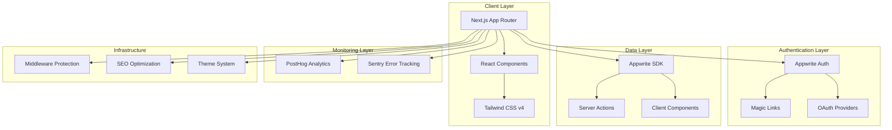

# Design Document

## Overview

DevBran.ch is architected as a modern, developer-focused SaaS platform built on Next.js 15 with App Router, leveraging Appwrite for backend services and emphasizing accessibility, performance, and developer experience. The platform follows a clean, minimalist design philosophy with a carefully curated color palette and comprehensive monitoring infrastructure.

The architecture prioritizes:
- **Accessibility-first design** with WCAG compliance
- **Performance optimization** through Next.js App Router and server components
- **Developer experience** with TypeScript, comprehensive tooling, and clear patterns
- **Scalability** through modular component architecture and feature-based organization
- **Observability** with integrated PostHog analytics and Sentry error tracking

## Architecture

### High-Level Architecture



### Project Structure

```
src/
├── app/                    # Next.js App Router pages
│   ├── (auth)/            # Authentication route group
│   │   ├── login/         # Login page
│   │   └── signup/        # Signup page
│   ├── dashboard/         # Protected dashboard
│   ├── globals.css        # Global styles with custom theme
│   ├── layout.tsx         # Root layout with monitoring
│   ├── page.tsx           # Landing page
│   ├── not-found.tsx      # 404 error page
│   └── error.tsx          # 500 error page
├── components/
│   ├── ui/                # Reusable UI components (shadcn/ui + custom)
│   ├── auth/              # Authentication-specific components
│   ├── dashboard/         # Dashboard-specific components
│   └── layout/            # Layout components (navbar, footer)
├── features/              # Domain-specific logic
│   ├── auth/              # Authentication feature
│   └── dashboard/         # Dashboard feature
├── lib/                   # Utility libraries and configurations
│   ├── appwrite.ts        # Appwrite SDK initialization
│   ├── posthog.ts         # PostHog configuration
│   ├── sentry.ts          # Sentry configuration
│   └── utils.ts           # Utility functions
├── hooks/                 # Custom React hooks
├── styles/                # Additional styling utilities
└── middleware.ts          # Route protection middleware
```

## Components and Interfaces

### Design System Foundation

#### Color Palette Implementation
The design system extends the existing Tailwind configuration with the specified DevBran.ch palette:

```css
:root {
  /* DevBran.ch Brand Colors */
  --devbranch-primary: #565264;      /* Primary brand color */
  --devbranch-accent-pink: #E8C7DE;  /* Accent pink */
  --devbranch-accent-green: #E7EBC5; /* Accent light green */
  --devbranch-accent-dark-green: #56876D; /* Accent dark green */
  --devbranch-text: #0C0C0C;         /* Primary text */
  
  /* Semantic color mappings */
  --primary: var(--devbranch-primary);
  --accent: var(--devbranch-accent-pink);
  --secondary: var(--devbranch-accent-green);
  --foreground: var(--devbranch-text);
}
```

#### Component Architecture
All UI components follow a consistent pattern:

```typescript
interface ComponentProps {
  className?: string;
  children?: React.ReactNode;
  variant?: 'default' | 'secondary' | 'accent';
  size?: 'sm' | 'md' | 'lg';
}

// Example: Button component with accessibility
export const Button = forwardRef<HTMLButtonElement, ComponentProps>(
  ({ className, variant = 'default', size = 'md', ...props }, ref) => {
    return (
      <button
        className={cn(buttonVariants({ variant, size }), className)}
        ref={ref}
        {...props}
      />
    );
  }
);
```

### Core Components

#### 1. Authentication Components

**LoginForm Component**
```typescript
interface LoginFormProps {
  onMagicLinkSubmit: (email: string) => Promise<void>;
  onOAuthLogin: (provider: 'google' | 'github') => Promise<void>;
  isLoading: boolean;
}
```

**AuthProvider Component**
```typescript
interface AuthContextType {
  user: User | null;
  login: (email: string) => Promise<void>;
  logout: () => Promise<void>;
  isLoading: boolean;
}
```

#### 2. Layout Components

**Navbar Component**
```typescript
interface NavbarProps {
  user?: User | null;
  showAuthButtons?: boolean;
  variant?: 'landing' | 'dashboard';
}
```

**ThemeProvider Component**
```typescript
interface ThemeContextType {
  theme: 'light' | 'dark' | 'system';
  setTheme: (theme: 'light' | 'dark' | 'system') => void;
}
```

#### 3. Dashboard Components

**DashboardLayout Component**
```typescript
interface DashboardLayoutProps {
  children: React.ReactNode;
  user: User;
  navigation: NavigationItem[];
}
```

### Form Handling Architecture

All forms use react-hook-form with zod validation:

```typescript
const loginSchema = z.object({
  email: z.string().email('Please enter a valid email address'),
});

type LoginFormData = z.infer<typeof loginSchema>;

export function LoginForm() {
  const form = useForm<LoginFormData>({
    resolver: zodResolver(loginSchema),
  });
  
  // Form implementation with accessibility
}
```

## Data Models

### User Model
```typescript
interface User {
  $id: string;
  email: string;
  name?: string;
  avatar?: string;
  emailVerification: boolean;
  prefs: UserPreferences;
  $createdAt: string;
  $updatedAt: string;
}

interface UserPreferences {
  theme: 'light' | 'dark' | 'system';
  notifications: boolean;
}
```

### Authentication Session
```typescript
interface AuthSession {
  $id: string;
  userId: string;
  expire: string;
  provider: string;
  providerUid: string;
  current: boolean;
}
```

### Analytics Event Model
```typescript
interface AnalyticsEvent {
  event: string;
  properties: Record<string, any>;
  userId?: string;
  timestamp: Date;
}
```

## Error Handling

### Error Boundary Strategy
```typescript
interface ErrorBoundaryState {
  hasError: boolean;
  error?: Error;
  errorInfo?: ErrorInfo;
}

class AppErrorBoundary extends Component<Props, ErrorBoundaryState> {
  // Captures errors and reports to Sentry
  // Displays branded error UI
}
```

### API Error Handling
```typescript
interface APIError {
  code: number;
  message: string;
  type: string;
}

// Centralized error handling utility
export function handleAPIError(error: APIError): string {
  // Maps Appwrite errors to user-friendly messages
  // Logs errors to Sentry with context
}
```

### Toast Notification System
Using Sonner for consistent toast notifications:

```typescript
interface ToastOptions {
  title: string;
  description?: string;
  variant: 'default' | 'success' | 'error' | 'warning';
  duration?: number;
}
```

## Testing Strategy

### Component Testing
- **Unit Tests**: Jest + React Testing Library for all UI components
- **Accessibility Tests**: Automated a11y testing with jest-axe
- **Visual Regression**: Storybook + Chromatic for component visual testing

### Integration Testing
- **Authentication Flow**: End-to-end testing of login/logout flows
- **Route Protection**: Testing middleware and protected route access
- **Form Validation**: Testing form submission and validation logic

### Performance Testing
- **Core Web Vitals**: Lighthouse CI integration
- **Bundle Analysis**: webpack-bundle-analyzer for optimization
- **Load Testing**: Basic load testing for critical user flows

## Monitoring and Analytics Implementation

### PostHog Integration
```typescript
// lib/posthog.ts
export const posthog = new PostHog(
  process.env.NEXT_PUBLIC_POSTHOG_KEY!,
  {
    api_host: process.env.NEXT_PUBLIC_POSTHOG_HOST,
    capture_pageview: false, // Manual pageview tracking
    capture_pageleave: true,
  }
);

// Custom hooks for analytics
export function useAnalytics() {
  const trackEvent = useCallback((event: string, properties?: Record<string, any>) => {
    posthog.capture(event, properties);
  }, []);
  
  return { trackEvent };
}
```

### Sentry Configuration
```typescript
// lib/sentry.ts
Sentry.init({
  dsn: process.env.NEXT_PUBLIC_SENTRY_DSN,
  environment: process.env.NODE_ENV,
  tracesSampleRate: 1.0,
  beforeSend(event) {
    // Filter sensitive data
    return event;
  },
});
```

### Route Change Tracking
```typescript
// app/layout.tsx
export default function RootLayout({ children }: { children: React.ReactNode }) {
  useEffect(() => {
    // Track route changes
    const handleRouteChange = (url: string) => {
      posthog.capture('$pageview', { $current_url: url });
    };
    
    // Implementation for App Router
  }, []);
}
```

## SEO and Performance Optimization

### Meta Tag Strategy
```typescript
// Dynamic metadata generation
export async function generateMetadata({ params }: PageProps): Promise<Metadata> {
  return {
    title: 'DevBran.ch - Developer Link Management',
    description: 'Professional link management for developers',
    openGraph: {
      title: 'DevBran.ch',
      description: 'Professional link management for developers',
      images: ['/og-image.png'],
    },
    twitter: {
      card: 'summary_large_image',
      title: 'DevBran.ch',
      description: 'Professional link management for developers',
    },
  };
}
```

### Performance Optimizations
- **Image Optimization**: Next.js Image component with proper sizing
- **Font Optimization**: Geist fonts with display: swap
- **Bundle Splitting**: Automatic code splitting via App Router
- **Caching Strategy**: Proper cache headers and static generation where possible

## Security Considerations

### Route Protection Middleware
```typescript
// middleware.ts
export function middleware(request: NextRequest) {
  const protectedRoutes = ['/dashboard', '/settings'];
  const authRoutes = ['/login', '/signup'];
  
  // JWT validation and route protection logic
}
```

### Content Security Policy
```typescript
const cspHeader = `
  default-src 'self';
  script-src 'self' 'unsafe-eval' 'unsafe-inline' *.posthog.com *.sentry.io;
  style-src 'self' 'unsafe-inline';
  img-src 'self' blob: data: *.appwrite.io;
  connect-src 'self' *.appwrite.io *.posthog.com *.sentry.io;
`;
```

## Accessibility Implementation

### WCAG Compliance Strategy
- **Semantic HTML**: Proper heading hierarchy and landmark elements
- **Keyboard Navigation**: Full keyboard accessibility for all interactive elements
- **Screen Reader Support**: ARIA labels and descriptions where needed
- **Color Contrast**: Minimum 4.5:1 contrast ratio for all text
- **Focus Management**: Visible focus indicators and logical tab order

### Accessibility Testing
```typescript
// Automated accessibility testing
import { axe, toHaveNoViolations } from 'jest-axe';

expect.extend(toHaveNoViolations);

test('should not have accessibility violations', async () => {
  const { container } = render(<Component />);
  const results = await axe(container);
  expect(results).toHaveNoViolations();
});
```

## Theme System Architecture

### Dark/Light Mode Implementation
```typescript
// Using next-themes for theme management
const ThemeProvider = ({ children }: { children: React.ReactNode }) => {
  return (
    <NextThemesProvider
      attribute="class"
      defaultTheme="system"
      enableSystem
      disableTransitionOnChange
    >
      {children}
    </NextThemesProvider>
  );
};
```

### CSS Custom Properties Strategy
The theme system leverages CSS custom properties for seamless theme switching:

```css
.dark {
  --background: var(--devbranch-primary);
  --foreground: oklch(0.985 0 0);
  --accent: var(--devbranch-accent-pink);
}
```

This design provides a solid foundation for building a scalable, accessible, and performant developer-focused platform while maintaining the clean, minimalist aesthetic specified in the requirements.